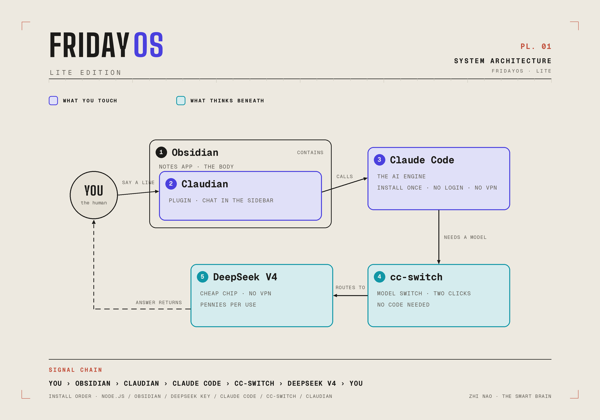
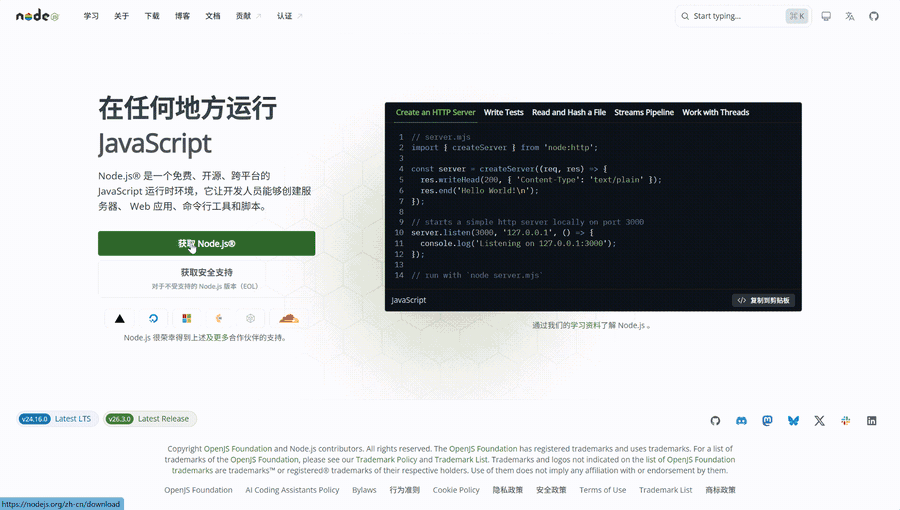
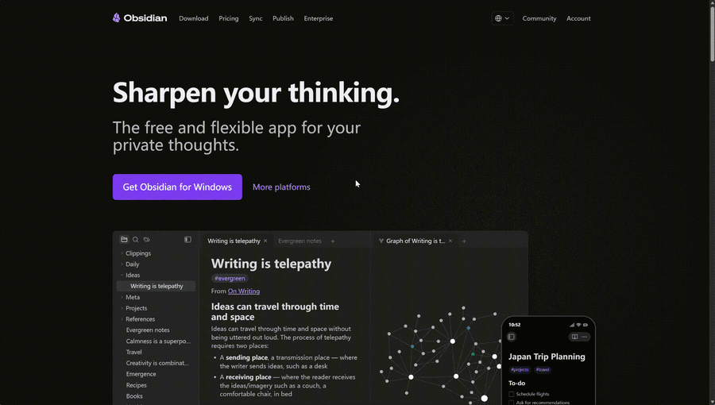
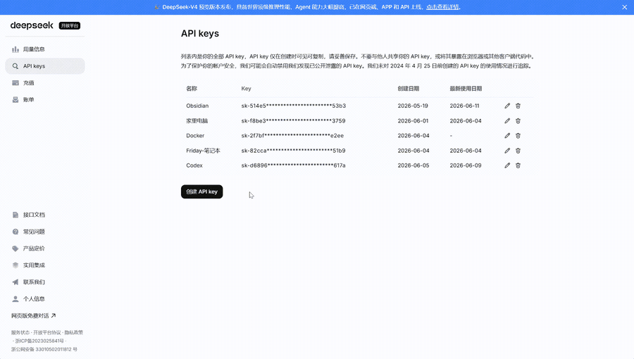
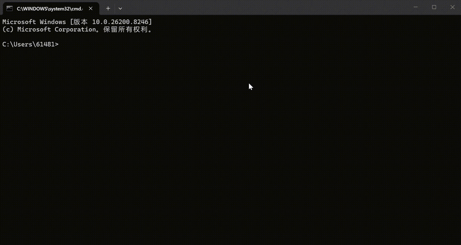
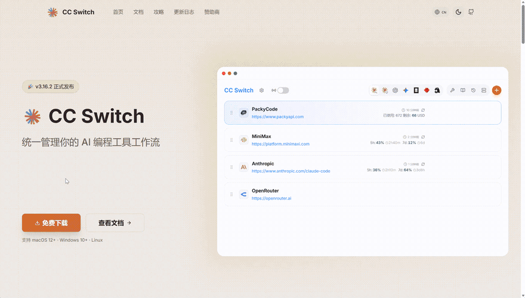
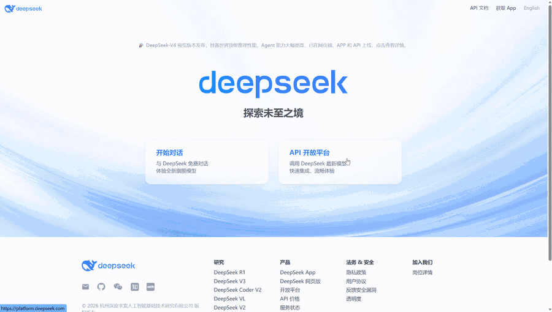
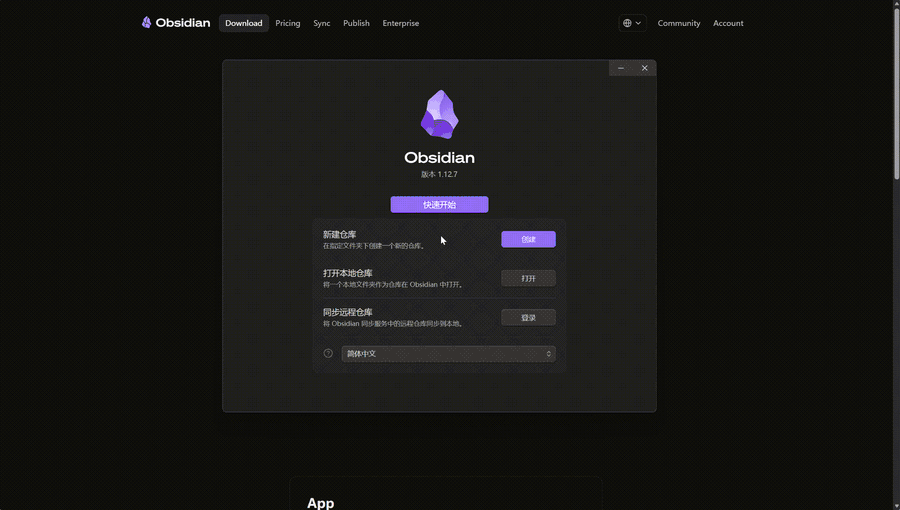
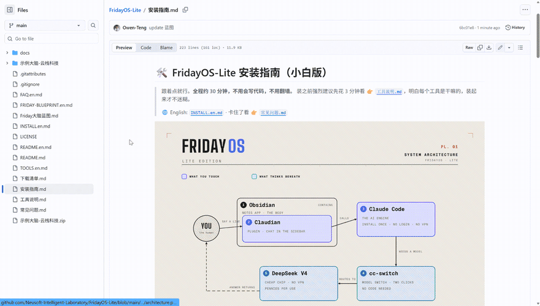

# 🛠️ FridayOS‑Lite Install Guide (for beginners)

> Just follow the clicks. **~30 minutes total, no coding, no VPN.**
> Strongly recommended: spend 3 minutes on [`TOOLS.en.md`](./TOOLS.en.md) first so each step makes sense.
>
> 🌐 中文版: [`安装指南.md`](./安装指南.md) · Stuck? 👉 [`FAQ.en.md`](./FAQ.en.md)



> The big picture: you → Obsidian (Claudian inside) → Claude Code engine → cc-switch → DeepSeek, and the answer flows back. We'll install in that spirit, step by step.

---

## 📋 Before you start

| Item | Notes |
|---|---|
| 💻 A computer | Windows or Mac (Claudian doesn't support phones/tablets) |
| 🌐 Internet | **No VPN needed** |
| ⏱️ ~30 minutes | First time? Take it slow — going over is normal |
| 💰 ~¥10 (≈$1.5) | Top up DeepSeek; usage is extremely cheap |

---

## ⚠️ Install order ≠ explanation order

[`TOOLS.en.md`](./TOOLS.en.md) explains outside-in: **Obsidian → Claudian → Claude Code → cc-switch → DeepSeek**. But we install in a different order, because cc-switch needs your DeepSeek key first, and Claudian comes last — it only works once the engine and model are wired up.

```
Step 0 Node.js (foundation) → Step 1 Obsidian + empty folder + Blueprint (body)
  → Step 2 DeepSeek key (the chip) → Step 3 Claude Code (the engine)
  → Step 4 cc-switch (wire the chip) → Step 5 Claudian (invite the AI in)
  → Step 6 One sentence — Friday builds the brain itself → ✅ Done
```

---

## Step 0: Install Node.js (foundation, 5 min)

**Why**: Claude Code and cc-switch are built on Node.js. Install once, forget forever.

1. Open [**nodejs.org**](https://nodejs.org) → click the big **"LTS"** button → download.
2. Double-click to install, click **Next** all the way, defaults are fine.
3. Verify:
   - Windows: `Win + R`, type `cmd`, Enter.
   - Mac: open **Terminal**.
   - Type and press Enter:
     ```
     node -v
     ```
   - A version number (like `v20.11.0`) means success ✅.



---

## Step 1: Install Obsidian + create an empty folder + add the Blueprint (5 min)

**Why**: Obsidian is your second brain's "body". All this step needs: one **empty folder** plus **one document**.

1. Open [**obsidian.md**](https://obsidian.md) → **Download** → install.
2. Create an **empty folder** on your computer, e.g. `My Brain`, somewhere easy to find like Documents.
3. **Download the one file — the Friday Brain Blueprint** — into that folder:
   - On this project's GitHub page, click **`FRIDAY-BLUEPRINT.en.md`**;
   - Click the **download icon (Download raw file, the ⬇ arrow)** at the top-right of the file view;
   - Move the downloaded file into `My Brain`.
4. Open Obsidian → **"Open folder as vault"** → select `My Brain`.
5. You'll see the Blueprint in the left sidebar. **Read it once** — it's the complete drawing of your second brain.

> Right now your brain is just a drawing — no building yet. **Don't create any folders by hand.**
> In Step 6, Friday will construct everything from the drawing itself.



---

## Step 2: Register DeepSeek + top up + get an API key (5 min)

**Why now**: the engine you install next needs this "key" immediately.

1. Open [**platform.deepseek.com**](https://platform.deepseek.com)
2. **Register and log in** with phone/email.
3. **Top up**: find "Billing / Balance", add **¥10** — plenty to start (pay-as-you-go, very cheap).
4. **Create a key**: left sidebar **"API keys"** → **"Create new API key"** → any name (e.g. `friday`).
5. ⚠️ **Critical**: the `sk-xxxxxxxx...` string **shows only once!**
   Copy it immediately into a notepad. Lost it? No panic — delete the key and create a new one.

> 🔒 This key = your account's password. **Never share it or post it online.**



**Note these two values for Step 4:**
- Base URL (Anthropic-compatible): `https://api.deepseek.com/anthropic`
- Models: `deepseek-v4-pro[1m]` (main, smart) and `deepseek-v4-flash` (light, cheap)

---

## Step 3: Install the Claude Code engine (one-time, no login, no VPN, 5 min)

**Why required**: many assume "Claudian alone is enough" — it isn't. **Claudian is only a shell**; it doesn't think. It drives Claude Code as its engine (an official hard requirement). Without it, Claudian throws errors like `spawn claude ENOENT`.

> ✅ **Relax**: this step **only installs a program — no subscription, no Anthropic login, no VPN**.
> The paid/VPN parts are exactly what cc-switch + DeepSeek eliminate in the next step.
> In one line: **Claude Code = the engine (install once); cc-switch = swap in DeepSeek's cheap chip.**

1. Open a terminal (Windows: `Win+R` → `cmd`; Mac: Terminal).
2. Paste this **whole line** and press Enter (uses a China mirror; outside China you may drop the `--registry` part):
   ```
   npm install -g @anthropic-ai/claude-code --registry=https://registry.npmmirror.com
   ```
3. Wait a minute or two (lots of scrolling text is normal).
4. Verify:
   ```
   claude --version
   ```
   A version number = success ✅.

> 💡 Don't run `claude` to log in yet — by default it connects to the paid official models.
> Next step, cc-switch points it at DeepSeek instead; no login ever needed.



---

## Step 4: Install cc-switch + wire up DeepSeek (3 min) ⭐ The key step

**Why**: cc-switch is the "switcher" — two clicks point the engine at DeepSeek. No code, no environment variables.

1. Open [**ccswitch.io**](https://ccswitch.io) (or the [GitHub releases page](https://github.com/farion1231/cc-switch/releases)).
2. Download for your system (Windows `.msi`/`.exe`; Mac `.dmg`), install with defaults.
3. Open cc-switch; the top tab defaults to **Claude** (that's the one we use).
4. Click **"+"** to add a Provider:
   - Pick **DeepSeek** from the preset list.
   - **API Key**: paste your `sk-...` from Step 2.
   - **Base URL**: confirm `https://api.deepseek.com/anthropic`.
   - **Models**: `deepseek-v4-pro[1m]` and `deepseek-v4-flash` (`[1m]` enables long context — keep it).
   - Save.
5. In **Settings**, enable both:
   - ✅ **Apply to Claude Code Plugin**
   - ✅ **Skip Claude Code Initial Setup**
6. Back on the main screen, **select the DeepSeek provider** → **"Sync to All Apps"**.

> 🎉 The engine now runs on DeepSeek! (Switching to Kimi, GLM, etc. later is one click here.)





---

## Step 5: Install Claudian — invite Friday into Obsidian (3 min)

**Why last**: engine and chip are wired; now the AI moves into your notes app. Goodbye, terminal.

1. Obsidian → **Settings (gear icon)**.
2. **"Community plugins"** → first time, click **"Turn on community plugins"**.
3. **"Browse"** → search **`Claudian`** → **Install** → **Enable**.
4. In Claudian's settings, set **Provider to "Claude"** (i.e., Claude Code).
   - It automatically uses your local engine — the one cc-switch wired to DeepSeek.
5. Close settings. A **Claudian icon** appears in the sidebar — that's your chat with Friday.

> ⚠️ Requires Obsidian ≥ 1.8.9 (fresh installs qualify). Desktop only.



---

## Step 6: One sentence — Friday builds the brain itself ✨

All tools in place. Time for Friday's first performance. In the Claudian chat, say:

> **Read the Friday Brain Blueprint and build my brain according to it.**

Friday follows the blueprint on its own: creates the six regions, writes its behavior contract (`system/CLAUDE.md`), installs three filing templates and two starter skills (inbox cleanup, weekly review), sets up your weekly plan and decision log — then **interviews you with three questions** (what to call you, what this brain manages, your preferred style) and writes your answers into its own contract. **You don't create a single folder, and by the end it already knows you.**

Then try:

> **Hi Friday, save to inbox: meeting with the boss at 3pm tomorrow.**

If it creates the note in `inbox/` by itself —

🎉 **Congratulations, your AI second brain is live!**

Daily/weekly plans and the inbox-cleanup command are all in Blueprint Section 7. Also try:
- "Put my three goals for this week into exec."
- "Clean up my inbox."

> ✅ It should end with a **self-check list** (Blueprint Section 6, step 11); if it doesn't, say "run the Section 6 step-11 self-check".
>
> 💡 If Friday doesn't act or builds it wrong: tell it "delete what you just made and re-execute Blueprint Section 6 exactly", or use the Blueprint's manual fallback — six folders by hand, two minutes.



---

## 🆘 Stuck?

| Symptom | Fix |
|---|---|
| `node -v` / `claude --version` does nothing | Close and **reopen** the terminal; confirm the previous step finished |
| `npm install` errors / very slow | Network issue — retry; see [`FAQ.en.md`](./FAQ.en.md) |
| Friday doesn't reply / balance error | DeepSeek not topped up, or wrong key in cc-switch |
| Claudian not found in search | Community plugins enabled? Obsidian ≥ 1.8.9? |
| Friday won't build from the Blueprint | Blueprint must sit in the vault root; tell it to "re-execute Section 6 exactly" |

More 👉 [`FAQ.en.md`](./FAQ.en.md)

---

*FridayOS‑Lite · One document, one sentence, one brain.*
