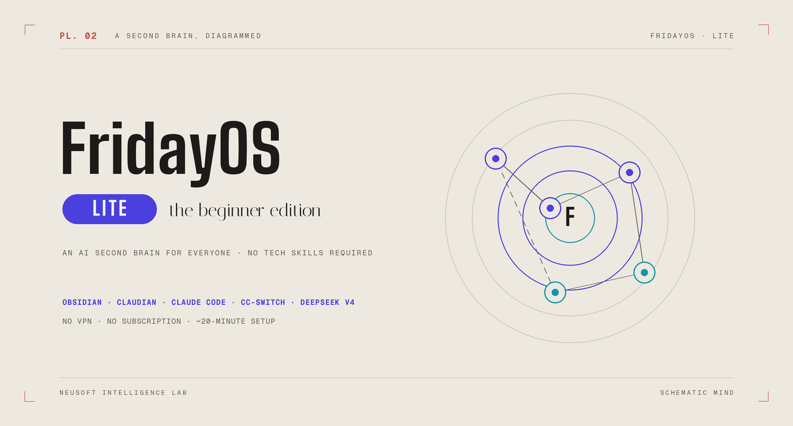

# 🤖 FridayOS‑Lite

### One document, one sentence, one AI second brain

**No tech skills. No template to download.** Install the Obsidian + Claudian five-tool stack,
drop one Brain Blueprint file into a folder, say one sentence —
and the AI builds your second brain, **Friday**, by itself.

[简体中文](./README.md) · English

   

Built by Neusoft Intelligence Lab · Want the agent-operated full version (auto-capture + mechanical safeguards)? See <a href="https://github.com/Neusoft-Intelligent-Laboratory/FridayOS">FridayOS</a>

---

## What Lite is — and isn't

**Lite focuses on one thing: teaching you to manage a knowledge base with Obsidian + Claudian** — the body of Friday's second brain. Learn the six-region partition idea, and let the AI capture, organize, and retrieve for you. Daily and weekly plans you write by hand in Obsidian, or dictate to Friday in chat.

It does **not** do automated integrations: no Feishu bot, no capture-from-anywhere messaging, and no mechanical safeguards (lint health checks, memory decay, inbound security). Those belong to the full [FridayOS](https://github.com/Neusoft-Intelligent-Laboratory/FridayOS) — where the AI doesn't just take notes for you, it **runs the whole brain under a contract**. Once the partition idea clicks, your folder moves over as-is. Zero migration.

**Lite is for people who:**
- Have never heard of Claude or Obsidian and don't know where to download them
- Freeze at words like "command line" or "environment variable"
- Don't want a VPN or a foreign-currency subscription
- Just want an AI that remembers, organizes, and answers

> If you can click a mouse and copy-paste one line, you can install it. ✅

## In three lines

1. **A folder is your brain** — all notes as local plain text, never locked in.
2. **An AI lives in your notes app** — chat with Friday in Obsidian's sidebar; it captures, organizes, finds.
3. **You don't build the brain** — download [`FRIDAY-BLUEPRINT.en.md`](./FRIDAY-BLUEPRINT.en.md), tell Friday "build from this", and the six regions appear by themselves.

## 🗺️ How it fits together

> Indigo = what you touch; teal = what thinks beneath. See [`TOOLS.en.md`](./TOOLS.en.md) for what each tool is and why.

## 🚀 Get started (three steps)

| Order | Read | Do |
|---|---|---|
| 1️⃣ Understand | [`TOOLS.en.md`](./TOOLS.en.md) | 3 min — what the five tools are for |
| 2️⃣ Install | [`INSTALL.en.md`](./INSTALL.en.md) | Set up the stack, then one sentence builds the brain |
| 3️⃣ If stuck | [`FAQ.en.md`](./FAQ.en.md) | Troubleshooting + download links |

> 👉 **Beginners: go 1→2→3, don't skip.** Understand first, then install.

## 🧠 Your brain after setup

Six regions, fully explained in [`FRIDAY-BLUEPRINT.en.md`](./FRIDAY-BLUEPRINT.en.md):

| Region | Folder | In a line |
|---|---|---|
| 📥 Inbox | `inbox/` | Capture fast, sort later |
| 🎯 Workbench | `exec/` | 3–7 things in motion + weekly/daily plans |
| 📚 Knowledge | `wiki/` | Worth keeping, wikilinked |
| ⚙️ Skills | `skills/` | Repeated work as routines (advanced) |
| 📦 Archive | `raw/` | Source material, read-only |
| 🫀 Core | `system/` | The brain's contract (`CLAUDE.md`) |

## 🎮 Just installed and feeling lost? Play the demo brain

An empty brain is hard to appreciate. We ship a **ready-to-play sandbox**: [`示例大脑-云栈科技/`](./示例大脑-云栈科技/) — a fictional 100-person IT company with full employee files, projects, customers, all wikilinked across the six regions, plus 11 demo prompts in three acts that each show something a free chatbot window cannot do. Download [`示例大脑-云栈科技.zip`](./示例大脑-云栈科技.zip), unzip, open as a vault, follow the demo manual inside. *(Demo content is Chinese-only.)*

## 📦 Tools you'll install (all free / very cheap)

| Tool | Role | From |
|---|---|---|
| Node.js | Foundation | [nodejs.org](https://nodejs.org) |
| Obsidian | The brain's body (notes app) | [obsidian.md](https://obsidian.md) |
| Claude Code | Friday's engine (the AI) | npm (China mirror) |
| cc-switch | Wires the engine to a cheap chip | [ccswitch.io](https://ccswitch.io) |
| DeepSeek V4 | Cheap, no-VPN model | [platform.deepseek.com](https://platform.deepseek.com) |
| Claudian | Brings the AI into Obsidian | Obsidian community plugin |

## 💬 Stuck?

<!-- TODO (before release): upload the WeCom group QR to docs/images/group-qr.png and uncomment -->
<!--  -->

Community group QR coming soon. Issues welcome at [Issues](../../issues).

---

FridayOS‑Lite · One document, one sentence, one brain.

