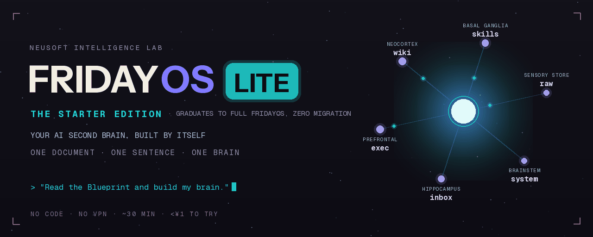
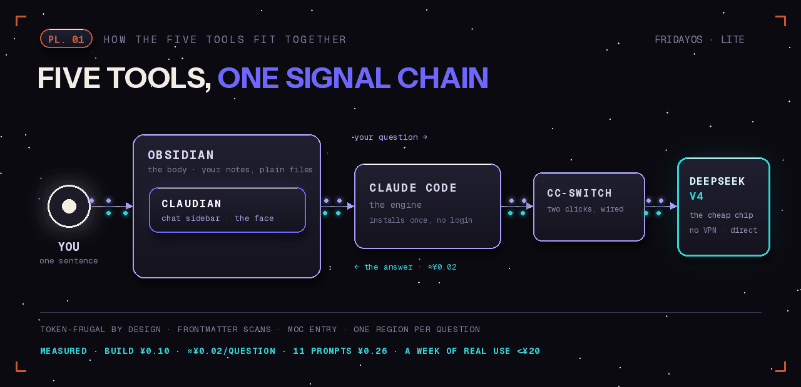
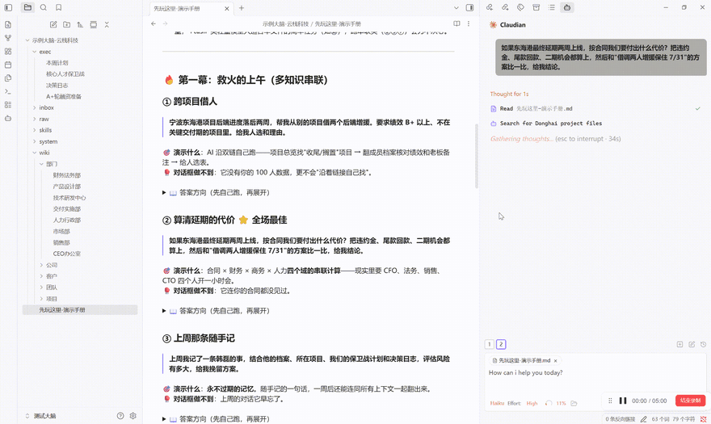

# 🤖 FridayOS‑Lite

### 一份文档，一句话，一个 AI 第二大脑

**不用懂技术。不用下载模板。** 装好 Obsidian + Claudian 五件套，
下载一份《大脑蓝图》丢进文件夹，对 AI 说一句话——
它自己把你的第二大脑 **Friday** 搭建出来。

简体中文 · [English](./README.md)

   

由 Neusoft Intelligence Lab 打造 · 想要 AI 自主运维的完整版（自动捕获 + 机械保障）？见 <a href="https://github.com/Neusoft-Intelligent-Laboratory/FridayOS">FridayOS</a>

---

## Lite 是什么、不是什么

**Lite 只专注一件事：教你用 Obsidian + Claudian 管好自己的知识库**——也就是 Friday 的"第二大脑"本体。学会六个脑区的分区理念，让 AI 帮你随手记、定期理、随时找。每日计划、周计划这类记录，你在 Obsidian 里手动写或在对话里让 Friday 代笔。

它**不做**自动化接入：没有飞书机器人、没有随时随地的消息捕获，也没有给大脑定期体检的机械保障（lint 脚本、记忆衰减、入站安全）。那些是正式版 [FridayOS](https://github.com/Neusoft-Intelligent-Laboratory/FridayOS) 的事——**AI 不只帮你记，还按一份契约自主运维整个大脑**。等你用 Lite 把分区理念用顺了，文件夹原样带过去升级即可，零迁移。

**Lite 给这样的你：**
- 没听过 Claude、Obsidian，也不知道去哪下、怎么装
- 一看"命令行""环境变量"就头大
- 不想翻墙、不想付外币订阅
- 只想要一个**能帮我记事、整理、随时问**的 AI 助理

> 如果你能照着说明点鼠标、复制粘贴一行字，你就能装好。✅

## 三句话讲清楚

1. **一个文件夹就是你的大脑** —— 所有笔记纯文本存在本地，永不锁定。
2. **一个 AI 住在你的笔记软件里** —— 在 Obsidian 侧边栏和 Friday 聊天，它帮你记、帮你整理、帮你找。
3. **大脑不用你搭** —— 下载一份 [`Friday大脑蓝图.md`](./Friday大脑蓝图.md)，对 Friday 说一句"照它搭建"，六个脑区自动建好。

## 💡 这套玩法有个名字：Vibe Knowledge Management

你可能听过 vibe coding——把想法说出来，AI 负责写代码。**Vibe Knowledge Management（VKM）** 就是同一件事在知识上的版本：**用自然语言驱动 AI 管理知识库。** 你不再亲手建文件夹、贴标签、修链接——你只管说话：随口记一句、问一个问题、说一声"老规矩"，归档、连接、检索全是 Friday 的活。

VKM 就是 Friday 的核心，Lite 是它最小的完整形态。也坦白说：这是一种很新的工作方式——它的可复制性、上手的认知成本，还需要更多用户来验证。**这正是这个仓库存在的意义。**

## 🗺️ 五个工具怎么搭起来

> 蓝色 = 你看见、动手操作的；绿色 = 幕后帮你思考的。每个工具是什么、为什么需要，详见 [`工具说明.md`](./工具说明.md)。

## 🚀 怎么开始（三步走）

| 顺序 | 看哪篇 | 做什么 |
|---|---|---|
| 1️⃣ 先理解 | [`工具说明.md`](./工具说明.md) | 3 分钟搞懂五个工具分别是干嘛的 |
| 2️⃣ 再动手 | [`安装指南.md`](./安装指南.md) | 跟着图文装好五件套，最后一句话让 Friday 搭出大脑 |
| 3️⃣ 卡住时 | [`常见问题.md`](./常见问题.md) · [`下载清单.md`](./下载清单.md) | 排错 + 所有官方下载链接 |

> 👉 **新手就按 1→2→3 的顺序来，别跳。** 先懂再装最省心。

## 🧠 搭好后，你的大脑长这样

六个脑区，理念全部写在 [`Friday大脑蓝图.md`](./Friday大脑蓝图.md) 里：

| 脑区 | 文件夹 | 一句话 |
|---|---|---|
| 📥 收件箱 | `inbox/` | 随手记——先接住，晚点整理 |
| 🎯 工作台 | `exec/` | 正在做——手头 3〜7 件事 + 周计划/每日记录 |
| 📚 知识库 | `wiki/` | 值得长期留的，双链互连 |
| ⚙️ 技能区 | `skills/` | 重复的事变套路（进阶） |
| 📦 资料库 | `raw/` | 原始资料——只读不改 |
| 🫀 中枢 | `system/` | 大脑说明书（`CLAUDE.md`） |

## 🎮 装完别懵：先玩示例大脑

刚搭好的大脑是空的，很难体会它强在哪。我们准备了一个**可以直接把玩的沙盘**：

**示例大脑「云栈科技」** —— 一家虚构的 100 人杭州 IT 公司。100 名员工档案（姓名/年龄/履历/项目/绩效/薪酬）、11 个项目、6 个客户全部双链互连，六个脑区部署完整，还埋了"薪酬倒挂""核心员工被挖"等剧情。

**怎么玩**：下载 [`示例大脑-云栈科技.zip`](./示例大脑-云栈科技.zip)（点开后点 ⬇ 下载按钮）→ 解压 → Obsidian 打开为 vault →**在这个新 vault 里重装一遍 Claudian（插件按 vault 各管各的，半分钟）**→ 照着里面的《先玩这里-演示手册》丢 11 个提示词给 Friday（救火/经营/助理三幕，每条附"答案方向"折叠块可对照自查）。每条都演示一种**免费大模型对话框做不到的事**：多知识串联、跨档案聚合、永不过期的记忆、一句"老规矩"的默契、好答案沉淀成技能。

> 建议做一次对照实验：把同样的问题贴到免费对话框里，高下立判。😏

## 💸 省 token 是架构出来的

六脑区不只是整洁——**它是 Friday 便宜得离谱的根本原因**。聚合查询扫结构化 frontmatter（每档几十 token）而不读全文；每个域有总览地图（MOC），Friday 从一页出发而不是翻十一页；问题只打开它所属的脑区；套路沉淀在 `skills/` 里按名调用，不用每次重新解释。

DeepSeek V4 实测（169 文件知识库）：搭建大脑 **¥0.10**，一条跨百档案的复杂分析 **约 ¥0.02**，连跑 11 条共 **¥0.26**。一个真实 10 人团队用这套架构跑了整周——用得最猛的人花费不到 **¥20**。

## 📦 要装的工具（全部免费/极便宜）

| 工具 | 作用 | 哪来的 |
|---|---|---|
| Node.js | 地基 | [nodejs.org](https://nodejs.org) |
| Obsidian | 大脑的身体（笔记软件） | [obsidian.md](https://obsidian.md) |
| Claude Code | Friday 的引擎（AI） | npm 国内镜像安装 |
| cc-switch | 把引擎接到便宜芯片 | [ccswitch.io](https://ccswitch.io) |
| DeepSeek V4 | 便宜免翻墙的模型 | [platform.deepseek.com](https://platform.deepseek.com) |
| Claudian | 让 AI 住进 Obsidian | Obsidian 社区插件 |

## 💬 卡住了？来群里问

<!-- TODO（发布前）：上传企业微信群二维码到 docs/images/group-qr.png，并取消下行注释 -->
<!--  -->

交流群二维码即将放出。也欢迎在本仓库提 [Issue](../../issues)。

---

FridayOS‑Lite · 一份文档，一句话，一个大脑。 One document, one sentence, one brain.

